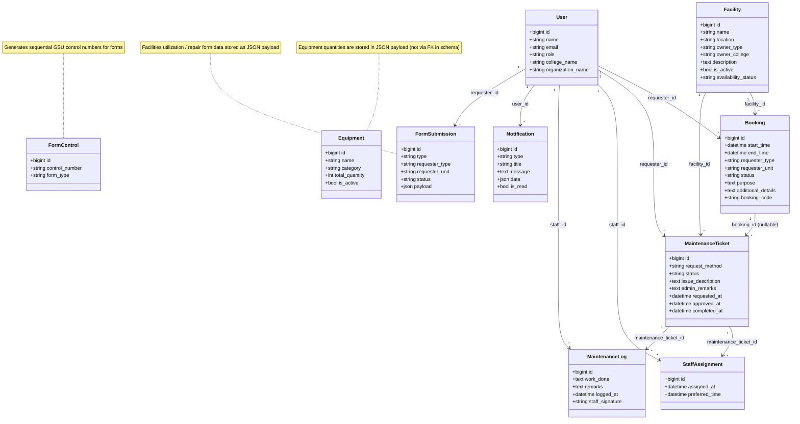

# Tech Stack, Architecture & ERD — UA Facility Management System

> **NOTE:** Status vocabulary has been normalized. What used to be called **"booked"** in older code and data is now consistently called **"reserved"** for active reservations. A background normalization step and migration ensure legacy `booked` rows are mapped to `reserved`, and past reservations auto‑transition to `completed` after `end_time`.
>
> - Active reservation statuses: `reserved`, `rescheduled`
> - Historical statuses: `completed`, `cancelled`
> - Form submission statuses: `pending`, `approved`, `reserved`, `disapproved`, `cancelled`
>
> Old references to `booked` in code, UI or data should be considered deprecated and are being phased out in favor of `reserved`.

---

## Table of Contents

1. [Tech Stack](#tech-stack)
2. [System Architecture](#system-architecture)
3. [Entity Relationship Diagram (ERD)](#entity-relationship-diagram-erd)

---

## Tech Stack

### Backend

| Component | Technology | Version | Purpose |
|---|---|---|---|
| Language | PHP | 8.2+ | Server-side programming |
| Framework | Laravel | 12.x | MVC web framework |
| ORM | Eloquent | (bundled with Laravel) | Database abstraction and model relationships |
| Templating | Blade | (bundled with Laravel) | Server-side HTML rendering |
| Database | MySQL | — | Production relational database |
| Session Driver | File/Database | — | Session-based authentication |

### Backend Dependencies (Composer)

| Package | Purpose |
|---|---|
| `phpoffice/phpword` | Generate DOCX documents (facilities utilization and repair forms) |
| `defuse/php-encryption` | Symmetric encryption utilities |
| `web-token/jwt-core` | JWT token support |
| `phpseclib/phpseclib` | PHP Secure Communications Library |
| `hashids/hashids` | Obfuscate numeric IDs into short hashed strings |
| `symfony/crypto` | Additional cryptographic utilities |

### Backend Dev Dependencies

| Package | Purpose |
|---|---|
| `fakerphp/faker` | Generate fake data for testing and seeding |
| `laravel/pail` | Real-time log tailing |
| `laravel/pint` | Code style fixer (PSR-12) |
| `laravel/sail` | Docker development environment |
| `phpunit/phpunit` | Unit and feature testing |
| `mockery/mockery` | Mock objects for testing |
| `nunomaduro/collision` | Better error reporting in CLI |

### Frontend

| Component | Technology | Version | Purpose |
|---|---|---|---|
| CSS Framework | Tailwind CSS | 4.x | Utility-first CSS styling |
| Build Tool | Vite | 7.x | Asset bundling and HMR |
| Vite Plugin | `laravel-vite-plugin` | 2.x | Laravel/Vite integration |
| HTTP Client | Axios | 1.x | AJAX requests |
| Fonts | Google Sans Flex, EB Garamond, Source Sans 3 | — | Typography |

### Frontend Dependencies (npm)

| Package | Purpose |
|---|---|
| `crypto-js` | Client-side encryption/hashing |
| `bcryptjs` | Client-side bcrypt hashing |
| `jsonwebtoken` | Client-side JWT handling |

### Frontend Dev Dependencies

| Package | Purpose |
|---|---|
| `@tailwindcss/vite` | Tailwind CSS Vite plugin |
| `concurrently` | Run multiple dev servers in parallel |
| `javascript-obfuscator` | Obfuscate client-side JavaScript |
| `terser` | JavaScript minification |

### Desktop Launchers (pywebview)

| Component | Technology | Purpose |
|---|---|---|
| Runtime | Python 3.x | Desktop launcher scripting |
| GUI Framework | pywebview | Lightweight embedded browser (CEF/WebKit) |
| Packager | PyInstaller | Bundle into standalone `.exe` files |
| Obfuscation | PyArmor | Protect Python source code |
| Security | cryptography, PyJWT, bcrypt | Token validation and key verification |

**Launcher Files:**
- `launchers/admin_launcher.py` — Admin Portal launcher
- `launchers/college_launcher.py` — College Staff Portal launcher
- `launchers/org_launcher.py` — Organization Staff Portal launcher

### Desktop Launchers (Electron — Alternative)

| Component | Technology | Purpose |
|---|---|---|
| Framework | Electron | 34.x | Cross-platform desktop app shell |
| Packager | electron-builder | 25.x | Build portable `.exe` files |
| Config | variant.json + write-variant.js | Role selection at build time |

**Launcher Files:**
- `launchers/electron/main.js` — Main process (gate screen → portal)
- `launchers/electron/gate.html` — Local key-entry gate UI
- `launchers/electron/preload.js` — Context bridge for IPC

### Mobile App (Android)

| Component | Technology | Purpose |
|---|---|---|
| Language | Kotlin | Native Android development |
| UI | Android WebView | Wraps the Laravel web portal |
| Build System | Gradle (Kotlin DSL) | Build and package APK |
| Target | Organization Staff only | Mirrors `org_launcher.py` behavior |

**App Files:**
- `android/ua-fms-org/app/.../GateActivity.kt` — Local key-entry gate screen
- `android/ua-fms-org/app/.../PortalActivity.kt` — WebView loading the Laravel portal
- `android/ua-fms-org/app/.../LauncherConfig.kt` — Build-time configuration constants

### Document Generation

| Component | Technology | Purpose |
|---|---|---|
| DOCX Generation | PHPOffice/PHPWord | Create Word documents from templates |
| PDF Conversion | LibreOffice (headless) | Convert DOCX → PDF on the server |

### Dev Tooling

| Tool | Purpose |
|---|---|
| `composer dev` | Runs Laravel server, queue, log tail, and Vite concurrently |
| `composer test` | Runs PHPUnit test suite |
| `composer setup` | Full project setup (install, key, migrate, build) |
| Laravel Pint | PHP code formatting |
| PHPUnit | Automated testing |

---

## System Architecture

### High-Level Architecture Diagram

```
┌─────────────────────────────────────────────────────────────────┐
│                        CLIENT LAYER                             │
│                                                                 │
│  ┌──────────────┐  ┌──────────────┐  ┌──────────────────────┐  │
│  │   Desktop    │  │   Desktop    │  │     Web Browser      │  │
│  │  Launchers   │  │  (Electron)  │  │   (Public Access)    │  │
│  │  (pywebview) │  │              │  │                      │  │
│  │              │  │  Admin       │  │  Public calendar     │  │
│  │  Admin       │  │  College     │  │  Login page          │  │
│  │  College     │  │  Org Staff   │  │  Role dashboards     │  │
│  │  Org Staff   │  │              │  │                      │  │
│  └──────┬───────┘  └──────┬───────┘  └──────────┬───────────┘  │
│         │                 │                      │              │
│  ┌──────┴─────────────────┴──────────────────────┘              │
│  │                                                              │
│  │  ┌──────────────────┐                                        │
│  │  │  Android App     │                                        │
│  │  │  (Kotlin WebView)│                                        │
│  │  │  Org Staff only  │                                        │
│  │  └────────┬─────────┘                                        │
│  │           │                                                  │
│  └───────────┤  All clients connect via HTTPS/HTTP              │
│              │  using FMS_ACCESS_TOKEN + role parameter          │
└──────────────┼──────────────────────────────────────────────────┘
               │
               ▼
┌──────────────────────────────────────────────────────────────────┐
│                     APPLICATION LAYER                            │
│                                                                  │
│  ┌────────────────────────────────────────────────────────────┐  │
│  │                    Laravel 12 (PHP 8.2)                    │  │
│  │                                                            │  │
│  │  ┌─────────────────────────────────────────────────────┐   │  │
│  │  │                   MIDDLEWARE                         │   │  │
│  │  │                                                     │   │  │
│  │  │  LoginAccessMiddleware    →  Token validation        │   │  │
│  │  │  auth (session)           →  Authentication          │   │  │
│  │  │  RoleMiddleware           →  Role-based access       │   │  │
│  │  │  CSRF protection          →  Form security           │   │  │
│  │  └─────────────────────────────────────────────────────┘   │  │
│  │                                                            │  │
│  │  ┌─────────────────────────────────────────────────────┐   │  │
│  │  │                  CONTROLLERS                        │   │  │
│  │  │                                                     │   │  │
│  │  │  AuthController           →  Login/logout            │   │  │
│  │  │  PublicCalendarController →  Public homepage          │   │  │
│  │  │  NotificationController   →  User notifications      │   │  │
│  │  │  GsuFormController        →  PDF form generation      │   │  │
│  │  │                                                     │   │  │
│  │  │  Admin\                                              │   │  │
│  │  │    DashboardController    →  Admin dashboard          │   │  │
│  │  │    FacilityController     →  CRUD facilities          │   │  │
│  │  │    BookingController      →  Manage bookings          │   │  │
│  │  │    FormSubmissionController → Review requests         │   │  │
│  │  │    FacilitiesFormPdfController → Generate PDFs        │   │  │
│  │  │    UserController         →  Manage users             │   │  │
│  │  │                                                     │   │  │
│  │  │  College\                                            │   │  │
│  │  │    DashboardController    →  College dashboard        │   │  │
│  │  │    FacilityController     →  College facilities       │   │  │
│  │  │    BookingController      →  Read-only calendar       │   │  │
│  │  │    FormController         →  Submit/view requests     │   │  │
│  │  │                                                     │   │  │
│  │  │  Org\                                                │   │  │
│  │  │    DashboardController    →  Org dashboard            │   │  │
│  │  │    BookingController      →  Read-only calendar       │   │  │
│  │  │    FormController         →  Submit/view requests     │   │  │
│  │  └─────────────────────────────────────────────────────┘   │  │
│  │                                                            │  │
│  │  ┌─────────────────────────────────────────────────────┐   │  │
│  │  │                     VIEWS                           │   │  │
│  │  │                                                     │   │  │
│  │  │  Blade Templates (41 files)                          │   │  │
│  │  │  Tailwind CSS v4 styling                             │   │  │
│  │  │  Vite asset bundling                                 │   │  │
│  │  │  Standalone PDF form views (facilities + repair)     │   │  │
│  │  └─────────────────────────────────────────────────────┘   │  │
│  │                                                            │  │
│  │  ┌─────────────────────────────────────────────────────┐   │  │
│  │  │                ELOQUENT MODELS                      │   │  │
│  │  │                                                     │   │  │
│  │  │  User, Facility, Equipment, Booking,                │   │  │
│  │  │  MaintenanceTicket, MaintenanceLog,                  │   │  │
│  │  │  StaffAssignment, FormControl, FormSubmission,       │   │  │
│  │  │  Notification                                        │   │  │
│  │  └─────────────────────────────────────────────────────┘   │  │
│  └────────────────────────────────────────────────────────────┘  │
│                                                                  │
└──────────────────────────────┬───────────────────────────────────┘
                               │
                               ▼
┌──────────────────────────────────────────────────────────────────┐
│                       DATA LAYER                                 │
│                                                                  │
│  ┌────────────────────────────────────────────────────────────┐  │
│  │                      MySQL Database                        │  │
│  │                                                            │  │
│  │  users, facilities, equipment, bookings,                   │  │
│  │  maintenance_tickets, maintenance_logs,                    │  │
│  │  staff_assignments, form_controls,                         │  │
│  │  form_submissions, notifications, sessions                 │  │
│  └────────────────────────────────────────────────────────────┘  │
│                                                                  │
│  ┌────────────────────────────────────────────────────────────┐  │
│  │                   File System Storage                      │  │
│  │                                                            │  │
│  │  Generated DOCX/PDF documents (temporary)                  │  │
│  │  Session files, cache, logs                                │  │
│  └────────────────────────────────────────────────────────────┘  │
│                                                                  │
└──────────────────────────────────────────────────────────────────┘
```

### Authentication & Access Flow

```
┌──────────────┐    Gate Key     ┌──────────────┐   access_token    ┌──────────────┐
│   Desktop    │ ──────────────→ │  Local Gate   │ ───────────────→  │   Laravel    │
│   Launcher   │    (validate)   │   Screen      │   + role param    │  /fms-portal │
│  or Mobile   │                 │               │                   │  -entry      │
└──────────────┘                 └──────────────┘                   └──────┬───────┘
                                                                          │
                                                                          ▼
                                                                   ┌──────────────┐
                                                                   │ LoginAccess  │
                                                                   │ Middleware   │
                                                                   │ (validates   │
                                                                   │  token)      │
                                                                   └──────┬───────┘
                                                                          │
                                                                          ▼
                                                                   ┌──────────────┐
                                                                   │  Login Page  │
                                                                   │  (email +    │
                                                                   │   password)  │
                                                                   └──────┬───────┘
                                                                          │
                                                                          ▼
                                                                   ┌──────────────┐
                                                                   │    Role      │
                                                                   │  Middleware  │
                                                                   │  (enforces   │
                                                                   │   role)      │
                                                                   └──────┬───────┘
                                                                          │
                                                     ┌────────────────────┼────────────────────┐
                                                     ▼                    ▼                    ▼
                                              ┌────────────┐     ┌──────────────┐     ┌────────────┐
                                              │   Admin    │     │   College    │     │    Org     │
                                              │ Dashboard  │     │  Dashboard   │     │ Dashboard  │
                                              └────────────┘     └──────────────┘     └────────────┘
```

### Role-Based Access Control (RBAC)

| Role | Dashboard | Facilities | Bookings | Requests | Users | Forms PDF | Notifications |
|---|---|---|---|---|---|---|---|
| **admin** | Admin dashboard | Full CRUD (all) | Full CRUD + calendar + overview | Review, approve, disapprove, convert | Create & list users | Generate & download | Yes |
| **college_staff** | College dashboard | CRUD (own college) | Read-only calendar | Submit & view own | — | — | Yes |
| **org_staff** | Org dashboard | — | Read-only calendar | Submit & view own | — | — | Yes |
| **viewer** | Public calendar | — | — | — | — | — | — |

### Request-to-Booking Workflow

```
College/Org Staff                         Admin (GSU)
      │                                       │
      │  1. Submit Facilities                  │
      │     Utilization Request                │
      │  ─────────────────────────────────→    │
      │     (FormSubmission created,           │
      │      status = 'pending')               │
      │                                        │
      │                                   2. Review request
      │                                        │
      │                                   3a. Approve
      │                                        │  (status → 'approved')
      │                                        │  Notification sent to requester
      │  ←─────────────────────────────────    │
      │     Notification: "approved"           │
      │                                        │
      │                                   3b. OR Disapprove
      │                                        │  (status → 'disapproved')
      │                                        │
      │                                   4. Generate PDF
      │                                        │  (PHPWord → DOCX → PDF)
      │                                        │
      │                                   5. Convert to Booking
      │                                        │  (Booking created,
      │                                        │   FormSubmission → 'converted')
      │                                        │  Notification sent to requester
      │  ←─────────────────────────────────    │
      │     Notification: "booking_created"    │
      │                                        │
      │                                   6. Manage booking
      │                                        │  (reschedule / cancel)
      │                                        │
```

### Deployment Architecture

```
┌─────────────────────────────────────────────────────────┐
│                    Production Server                     │
│                                                         │
│  ┌─────────────┐    ┌──────────────┐    ┌───────────┐  │
│  │  Web Server  │    │   Laravel    │    │   MySQL   │  │
│  │  (Apache/    │───→│   App       │───→│  Database  │  │
│  │   Nginx)    │    │  (PHP 8.2)  │    │           │  │
│  │  + TLS      │    │             │    │           │  │
│  └─────────────┘    └──────────────┘    └───────────┘  │
│                            │                            │
│                     ┌──────┴──────┐                     │
│                     │ LibreOffice │                     │
│                     │ (headless)  │                     │
│                     │ DOCX → PDF  │                     │
│                     └─────────────┘                     │
└─────────────────────────────────────────────────────────┘
        ▲                    ▲                    ▲
        │                    │                    │
   ┌────┴─────┐     ┌───────┴──────┐    ┌───────┴──────┐
   │ Desktop  │     │  Web Browser │    │   Android    │
   │ Launcher │     │  (Direct     │    │   App        │
   │ (.exe)   │     │   Access)    │    │  (APK)       │
   └──────────┘     └──────────────┘    └──────────────┘
```

### Directory Structure

```
Capstone-Univerity-Of-Antique-Facility-Management-System/
│
├── app/
│   ├── Http/
│   │   ├── Controllers/
│   │   │   ├── Admin/              ← Admin controllers (6)
│   │   │   ├── College/            ← College staff controllers (4)
│   │   │   ├── Org/                ← Org staff controllers (3)
│   │   │   ├── AuthController.php
│   │   │   ├── GsuFormController.php
│   │   │   ├── NotificationController.php
│   │   │   └── PublicCalendarController.php
│   │   ├── Middleware/
│   │   │   ├── RoleMiddleware.php
│   │   │   └── LoginAccessMiddleware.php
│   │   └── ...
│   ├── Models/                     ← Eloquent models (10)
│   └── Providers/
│       └── AppServiceProvider.php  ← Global notification count view composer
│
├── resources/
│   ├── views/
│   │   ├── layouts/                ← Layout templates (4 + 1 partial)
│   │   ├── admin/                  ← Admin views (14)
│   │   ├── college/                ← College views (12)
│   │   ├── org/                    ← Org views (3)
│   │   ├── forms/                  ← GSU PDF form views (2)
│   │   ├── notifications/          ← Notification views (1)
│   │   ├── auth/                   ← Auth views (1)
│   │   ├── public/                 ← Public views (1)
│   │   └── welcome.blade.php      ← Legacy placeholder
│   ├── css/app.css
│   └── js/app.js
│
├── routes/
│   └── web.php                     ← All route definitions
│
├── database/
│   ├── migrations/                 ← Schema migrations (13)
│   ├── seeders/                    ← FacilitySeeder + DatabaseSeeder
│   └── factories/                  ← Model factories
│
├── launchers/                      ← Desktop launchers
│   ├── admin_launcher.py           ← Admin (pywebview)
│   ├── college_launcher.py         ← College (pywebview)
│   ├── org_launcher.py             ← Org (pywebview)
│   ├── electron/                   ← Electron alternative
│   │   ├── main.js
│   │   ├── gate.html
│   │   ├── preload.js
│   │   └── package.json
│   └── requirements.txt
│
├── android/
│   └── ua-fms-org/                 ← Android WebView app (Org only)
│       ├── app/src/main/.../
│       │   ├── GateActivity.kt
│       │   ├── PortalActivity.kt
│       │   └── LauncherConfig.kt
│       └── build.gradle.kts
│
├── DEPLOYMENT_GUIDE.md
├── composer.json
├── package.json
└── vite.config.js
```

---

## Entity Relationship Diagram (ERD)

### Text-Based ERD





┌─────────────────────────────────┐
│              USER               │
├─────────────────────────────────┤
│ PK  id              BIGINT     │
│     name            VARCHAR    │
│     email           VARCHAR UQ │
│     email_verified_at TIMESTAMP│
│     password        VARCHAR    │
│     remember_token  VARCHAR    │
│     role            VARCHAR    │
│     college_name    VARCHAR    │
│     organization_name VARCHAR  │
│     created_at      TIMESTAMP  │
│     updated_at      TIMESTAMP  │
└──────────┬──────────────────────┘
           │
           │ 1
           │
     ┌─────┼──────────┬──────────────┬───────────────┐
     │     │          │              │               │
     │ ∞   │ ∞        │ ∞            │ ∞             │ ∞
     ▼     ▼          ▼              ▼               ▼
┌──────────────┐ ┌──────────────┐ ┌──────────────┐ ┌──────────────┐ ┌──────────────────┐
│   BOOKING    │ │ MAINTENANCE  │ │    STAFF     │ │ MAINTENANCE  │ │   NOTIFICATION   │
│              │ │   TICKET     │ │  ASSIGNMENT  │ │     LOG      │ │                  │
├──────────────┤ ├──────────────┤ ├──────────────┤ ├──────────────┤ ├──────────────────┤
│PK id         │ │PK id         │ │PK id         │ │PK id         │ │PK id             │
│FK requester_id│ │FK facility_id│ │FK maint_     │ │FK maint_     │ │FK user_id        │
│FK facility_id│ │FK requester_id││   ticket_id  │ │   ticket_id  │ │   type           │
│   start_time │ │FK booking_id │ │FK staff_id   │ │FK staff_id   │ │   title          │
│   end_time   │ │   request_   │ │   assigned_at│ │   work_done  │ │   message        │
│   requester_ │ │     method   │ │   preferred_ │ │   remarks    │ │   data (JSON)    │
│     type     │ │   status     │ │     time     │ │   logged_at  │ │   is_read        │
│   requester_ │ │   issue_     │ └──────────────┘ │   staff_     │ └──────────────────┘
│     unit     │ │   description│                   │   signature  │
│   status     │ │   admin_     │                   └──────────────┘
│   request_   │ │     remarks  │
│     method   │ │   requested_ │
│   purpose    │ │     at       │
│   additional_│ │   approved_at│
│     details  │ │   completed_ │
│   requested_ │ │     at       │
│     at       │ └──────────────┘
│   approved_at│
│   booking_   │
│     code UQ  │
└──────┬───────┘
       │
       │ 1
       │
       │ ∞
       ▼
┌──────────────┐
│ MAINTENANCE  │
│   TICKET     │
│ (booking_id) │
└──────────────┘


┌─────────────────────────────────┐
│            FACILITY             │
├─────────────────────────────────┤
│ PK  id              BIGINT     │
│     name            VARCHAR    │
│     location        VARCHAR    │
│     owner_type      VARCHAR    │
│     owner_college   VARCHAR    │
│     description     TEXT       │
│     is_active       BOOLEAN    │
│     availability_   VARCHAR    │
│       status                   │
│     created_at      TIMESTAMP  │
│     updated_at      TIMESTAMP  │
└──────────┬──────────────────────┘
           │ 1
           │
     ┌─────┴──────────┐
     │ ∞              │ ∞
     ▼                ▼
┌──────────┐   ┌──────────────┐
│ BOOKING  │   │ MAINTENANCE  │
│          │   │   TICKET     │
└──────────┘   └──────────────┘


┌─────────────────────────────────┐       ┌─────────────────────────────────┐
│          FORM_CONTROL           │       │        FORM_SUBMISSION          │
├─────────────────────────────────┤       ├─────────────────────────────────┤
│ PK  id              BIGINT     │       │ PK  id              BIGINT     │
│     control_number  VARCHAR UQ │       │     type            VARCHAR    │
│     form_type       VARCHAR    │       │ FK  requester_id    BIGINT     │
│     created_at      TIMESTAMP  │       │     requester_type  VARCHAR    │
│     updated_at      TIMESTAMP  │       │     requester_unit  VARCHAR    │
└─────────────────────────────────┘       │     status          VARCHAR    │
                                          │     payload         JSON       │
┌─────────────────────────────────┐       │     created_at      TIMESTAMP  │
│           EQUIPMENT             │       │     updated_at      TIMESTAMP  │
├─────────────────────────────────┤       └─────────────────────────────────┘
│ PK  id              BIGINT     │                    │
│     name            VARCHAR    │                    │ ∞
│     category        VARCHAR    │                    │
│     total_quantity  INTEGER    │                    ▼
│     is_active       BOOLEAN    │               ┌──────────┐
│     created_at      TIMESTAMP  │               │   USER   │
│     updated_at      TIMESTAMP  │               │   (1)    │
└─────────────────────────────────┘               └──────────┘
```

### Relationship Summary Table

| Relationship | From | To | Type | Foreign Key | On Delete |
|---|---|---|---|---|---|
| User → Bookings | User | Booking | One-to-Many | `bookings.requester_id` | CASCADE |
| User → MaintenanceTickets | User | MaintenanceTicket | One-to-Many | `maintenance_tickets.requester_id` | CASCADE |
| User → StaffAssignments | User | StaffAssignment | One-to-Many | `staff_assignments.staff_id` | CASCADE |
| User → MaintenanceLogs | User | MaintenanceLog | One-to-Many | `maintenance_logs.staff_id` | CASCADE |
| User → Notifications | User | Notification | One-to-Many | `notifications.user_id` | CASCADE |
| User → FormSubmissions | User | FormSubmission | One-to-Many | `form_submissions.requester_id` | CASCADE |
| Facility → Bookings | Facility | Booking | One-to-Many | `bookings.facility_id` | CASCADE |
| Facility → MaintenanceTickets | Facility | MaintenanceTicket | One-to-Many | `maintenance_tickets.facility_id` | CASCADE |
| Booking → MaintenanceTickets | Booking | MaintenanceTicket | One-to-Many | `maintenance_tickets.booking_id` | SET NULL |
| MaintenanceTicket → StaffAssignments | MaintenanceTicket | StaffAssignment | One-to-Many | `staff_assignments.maintenance_ticket_id` | CASCADE |
| MaintenanceTicket → MaintenanceLogs | MaintenanceTicket | MaintenanceLog | One-to-Many | `maintenance_logs.maintenance_ticket_id` | CASCADE |

### Standalone Tables (No Foreign Key Relationships)

| Table | Purpose |
|---|---|
| `equipment` | Equipment inventory (referenced only via JSON payload in form submissions) |
| `form_controls` | Control number sequence tracking for GSU forms |
| `sessions` | Laravel session storage |

### Cardinality Summary

```
User (1) ───────── (∞) Booking
User (1) ───────── (∞) MaintenanceTicket
User (1) ───────── (∞) StaffAssignment
User (1) ───────── (∞) MaintenanceLog
User (1) ───────── (∞) Notification
User (1) ───────── (∞) FormSubmission

Facility (1) ───── (∞) Booking
Facility (1) ───── (∞) MaintenanceTicket

Booking (1) ────── (∞) MaintenanceTicket  [nullable, SET NULL on delete]

MaintenanceTicket (1) ── (∞) StaffAssignment
MaintenanceTicket (1) ── (∞) MaintenanceLog

Equipment ──── (standalone)
FormControl ── (standalone)
```
